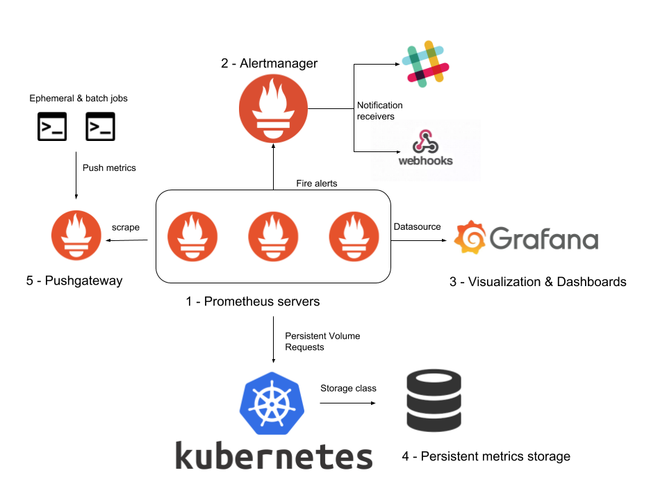

<!-- section 0 -->

# jMeter Workshop {#jmeter-workshop .light-on-dark bgcss="sea-gradient" x="0" y="0" rz="-.1"}

{height="20%" width="20%"}

<!-- section 1 -->

# jMeter Workshop

Agenda:

  Tag 1                                 Tag 2
  ------------------------------------- ------------------------------------
  \(3\) jMeter Plugin-Manager           \(3\) Verteiltes Testen mit jMeter
  \(3\) Workload Design                 \(3\) IaC
  \(2\) Strukturierung von Testplänen   \(3\) RMI
  \(2\) Scripting                       \(2\) Monitoring
  \(2\) Reporting                       \(1\) Containerisierung
  \(1\) Testdatenverwaltung             \(1\) CI/CD-Pipeline
  \(1\) REST-APIs                       Klärung offener Punkte

<!-- section 2 -->

# jMeter Plugin-Manager {#jmeter-plugin-manager .light-on-dark bgcss="sea-gradient" x="0" y="0" rz="-.1"}

<!-- section 3 -->

# jMeter Plugin-Manager

<https://jmeter-plugins.org/wiki/PluginsManager/>

**Installation:**

-   lade **<https://jmeter-plugins.org/get/>** herunter
-   kopiere **jar** in das jMeter-Verzeichnis **lib/ext**

<!-- section 4 -->

# jMeter Plugin-Manager

**Ausführung über die Kommandozeile:**

<https://jmeter-plugins.org/wiki/PluginsManagerAutomated/>

`PluginsManagerCMD <command> [<params>]`

z.B.

`PluginsManagerCMD install jpgc-fifo,jpgc-json=2.2`

<!-- section 5 -->

# jMeter Plugin-Manager

**Falls man hinter einem Proxy ist:**

`JVM_ARGS="-Dhttps.proxyHost=myproxy.com -Dhttps.proxyPort=8080 -Dhttp.proxyUser=john -Dhttp.proxyPass=***" PluginsManagerCMD status`

<!-- section 6 -->

# jMeter Plugin-Manager

**Eigenes Plugin schreiben:**

<https://jmeter.apache.org/usermanual/jmeter_tutorial.html>

**Eigenes Repository hinzufügen:**

jMeter-Property setzen:

`jpgc.repo.address=https://jmeter-plugins.org/repo/;http://my.intranet.site/plugins-repo.json`

Das Repository-JSON muss folgendes Format erfüllen: <https://jmeter-plugins.org/wiki/PluginRepositoryDescriptorFormat/>

Gute Anleitung: <https://www.blazemeter.com/blog/how-to-create-a-local-repository-of-jmeter-plugins>

<!-- section 7 -->

# jMeter Plugin-Manager

**Nützliche Plugins:**

-   Custom Thread Groups
-   JMXMon Sample Collector
-   jp\@gc - PerfMon
-   jp\@gc - Dummy Sampler
-   jp\@gc - PlanCheck

Weitere nützliche Plugins: 

<!-- section 8 -->

# jMeter Plugin-Manager

**Ultimate Thread Group**

{height="40%" width="40%"}

<!-- section 9 -->

# jMeter Plugin-Manager

**Concurrency Thread Group**

{height="40%" width="40%"}

<!-- section 10 -->

# jMeter Plugin-Manager

**jp\@gc - PerfMon**

{height="40%" width="40%"}

<!-- section 11 -->

# jMeter Plugin-Manager

**jp\@gc - Dummy Sampler**

{height="40%" width="40%"}

<!-- section 12 -->

# jMeter Plugin-Manager

**jp\@gc - PlanCheck**

<https://jmeter-plugins.org/wiki/TestPlanCheckTool/>

Usage:

`jmeter/lib/ext/TestPlanCheck.sh --jmx MyTestPlan.jmx --stats --tree-dump`

<!-- section 13 -->

# jMeter Plugin-Manager

**JMXMon Sample Collector**

{height="40%" width="40%"}

<!-- section 14 -->

# Workload Design {#workload-design .light-on-dark bgcss="sea-gradient" x="0" y="0" rz="-.1"}

<!-- section 15 -->

# Workload

Definition:

> The amount of work a system has to perform in a given time. In the performance field, a workload usually refers to combined load placed on an application by the set of clients it services

<!-- section 16 -->

# Performance Test-Arten

<!-- section 17 -->

# Performance Test-Arten

-   **Load Testing:** Modelliert die erwartete Benutzung

-   **Stress Testing:** Bestimmung des Limits an Concurrent Usern bis Fehler auftreten

-   **Soak/Endurance Testing:** Festgelegte Load die über einen definierten Zeitraum aufrecht erhalten wird

-   **Spike Testing:** testen von schnellem Anstieg/Abfall der Load -\> z.B. Ticketverkauf

-   **Volume Testing:** Testen ob Applikation mit einem bestimmten Datenvolumen klar kommt

-   **Scalability Testing:** Testet die Fähigkeit einer Applikation hoch/runter zu skalieren

<!-- section 18 -->

# Prinzipien

-   Vorhersagbarkeit

-   Wiederholbarkeit

-   Skalierbarkeit

<!-- section 19 -->

# Vorhersagbarkeit

> Das Verhalten des Systems (z.B. Prozessanfragen, Datenzugriffe, ...) sollte während die Workload läuft vorhersehbar sein.

<!-- section 20 -->

# Wiederholbarkeit

> Wenn eine Workload mehrere male auf identische Weise ausgeführt wird, sollte die Ergebnis nahezu identisch ausführen. Ansonsten wird eine Performance-Analyse sehr schwer.

<!-- section 21 -->

# Skalierbarkeit

> Eine Workload solle mit unterschiedlichen Lasten ausgeführt werden können um die Skalierbarkeit der Anwendung testen zu können.

<!-- section 22 -->

# Workload Design Steps

-   Design der Applikation
-   Key-Szenarios identifizieren
-   Definieren der Metriken
-   Design der Load
-   Definieren der Skalierungsregeln
-   Design des Load-Generators
-   Festlegung einer Baseline

<!-- section 23 -->

# Design der Applikation

-   Definieren der Aktoren und Use-Cases → Hilft die Operationen der Workload zu definieren

-   Definieren der Operationen

    -   Im einfachsten Fall mappt jeder User-Case auf eine Operation
    -   Für sinnvolle Workloads solle die Zahl der benötigen Operation klein gehalten werden (6-8) → Ansonsten schwer zu managen und verstehen

<!-- section 24 -->

# Key-Szenarios identifizieren

-   Messbares Szenario: Ein User-Szenario das Performance-getestet werden soll, sollte vollständig messbar sein
-   Meistbenutzte Szenarios
-   Business-kritische Szenarios
-   Ressourcen-intensive Szenarios
-   Zeitabhängig häufig genutzte Szenarios: z.B. Weihnachts-Liste auf Amazon
-   Stakeholder-relevante Szenarien

<!-- section 25 -->

# Key-Szenarios identifizieren

Beispiel für eine E-Commerce-Applikation:

-   Browsen des Produktkatalogs
-   Benutzeraccount anlegen
-   Nach einem Produkt suchen
-   Login
-   Bestellung abschicken

Navigationspfade der Key-Szenarios untersuchen

-   Auf welche Arten kann ich z.B. eine Bestellung abschicken
-   Wie häufig wird welcher Weg genutzt? → Logfiles oder Analysetools (z.B Matomo)

<!-- section 26 -->

# Definieren der Metriken

Typische Metriken sind:

-   **Durchsatz:** Wie viele Operation können vom SUT während einer gewissen Zeit verarbeitet werden

-   **Antwortzeiten:** Zeit zwischen Ende der Anfrage und Beginn der Antwort an das SUT → Macht normalerweise nur Sinn wenn es auch Anforderungen für Antwortzeiten gibt

-   **Ressourcenverbrauch:** z.B. alle Ressourcen (IO, Memory, ...) sollten nicht mehr als 70% der max. Auslastung haben

-   **Anzahl maximaler Benutzer:** Wie viele Benutzer können gleichzeitig ohne Probleme auf dem SUT arbeiten

<!-- section 27 -->

# Design der Load

-   der wichtigste Schritt im Workload Design!

-   die Relevanz der Workload hängt davon ab wie genau sie die die reale Produktionslast emuliert

-   gleichzeit wichtig: die Test-Workload solle sich auf die signifikanten Aspekte der Live-Load konzentrieren → Ansonsten wird es zu kompliziert

<!-- section 28 -->

# Design der Load

-   **Arrival Rates:** Die Rate mit der Requests an das SUT gestellt werden

-   **Think Times:** Zeit zwischen Anzeige der Daten beim Benutzer und seiner nächsten Interaktion → Bei großen Datenmenge steigt diese Zeit

-   **Browser Mix:** Welche Browser sollen im Test verwendet werden? Chrome, Firefox, ...

-   **Network Mix:** Welche Netzwerkgeschwindigkeiten sollen im Test verwendet werden? z.B. 3G

<!-- section 29 -->

# Design der Load

-   **Operation Mix:** Festlegung in welcher Frequenz welche Operation durchgeführt wird → oft prozentual je Operation was sich zu 100% summiert

<!-- section 30 -->

# Design der Load

**Operation Mix:**

-   Flat Mix:
    -   Einfachste Möglichkeit
    -   wird verwendet wenn Operation unabhängig sind und die gleiche Wahrscheinlichkeit haben
    -   → Der Mix wählt eine Operation zufällig

<!-- section 31 -->

# Design der Load

**Operation Mix:**

-   Flat Sequence Mix:
    -   Spezifiziert ein Set von Operations-Sequenzen
    -   z.B. Set1=Op1,Op2 und Set2=Op1,Op3
    -   jedem Set wird eine Wahrscheinlichkeit zugeordnet und dementsprechend ausgewählt

<!-- section 32 -->

# Design der Load

**Operation Mix:**

-   Matrix Mix (Transition Mix):
    -   Beschreibt die Übergangswahrscheinlichkeiten in einem Markov-Modell
    -   wird häufig bei Web-Apps verwendet

<!-- section 33 -->

# Design der Load

Beispiel-Workload als Matrix-Mix:

  From     To Page 1   To Page 2   To Page 3
  -------- ----------- ----------- -----------
  Page 1   0,00 %      80,00%      20,00%
  Page 2   20,00%      39,00%      41,00%
  Page 3   60,00%      19,00%      21,00%

<!-- section 34 -->

# Design der Load

-   Abhängig von der Operation müssen für den Request diverse Input-Daten generiert werden

-   Um ein realistisches Szenario zu erhalten sollten die Daten variiert werden → Bei 100 Items sollten nicht immer fix 5 selektiert werden

<!-- section 35 -->

# Design der Load

-   Best-Practice: Eine klein Zahl an Fehlern durch invalide Daten einfügen um auch Probleme im Error-Handling aufzudecken

-   Genieren "echter" Daten kann bei großen Daten problematisch werden → Workload Entwickler müsste all Möglichen Values kennen

    -   Uniform Random: Generierung von gleichverteilten Zufallsdaten, z.B. für Anzahl gewählter Items
    -   Non-Uniform Random: im Normalfall sind Datenzugriffe nicht gleichverteilt! → Datengenerierung sollte Wahrscheinlichkeit berücksichtigen

<!-- section 36 -->

# Definieren der Skalierungsregeln

Häufig skaliert man durch Erhöhung der emulierten Benutzer.
Weitere Möglichkeiten sind:

**Linear Scaling**

-   alles wird über einen einzigen Skalierungsfaktor skaliert
-   z.B. Workload führt Datenzugriffe eines Benutzers aus → Anzahl Benutzer & Anzahl Datenzugriffe werden beide skaliert
-   Häufig nützlich für "Sizing"-Zwecke

**Non-linear Scaling**

-   Anwendungen skalieren oft nicht linear
-   z.B. Tagging durch Benutzer → mit steigender Anzahl steigt die Last je User mit an, z.B. bei der Anzeige der Tags

<!-- section 37 -->

# Design des Load-Generators

Der Load-Generator implementiert die Workload

Dabei sollte beachtet werden:

-   Zum simulieren mehrerer Benutzer-Connections sollte **kein** connection-pooling verwendet werden

-   Jeder simulierte Nutzer sollte nach Möglichkeit seinen eigenen "Random number generator" (seeded mit unique value) verwenden um wirklich zufällige Daten zu bekommen

<!-- section 38 -->

# Festlegung einer Baseline

> \"A Baseline is the process of capturing performance metric data for the sole purpose of evaluating the efficacy of successive changes to the system or application. It is important that all characteristics and configurations, except those specifically being varied for comparison, remain the same in order to make effective comparisons as to which change (or series of changes) is driving results toward the targeted goal.

<!-- section 39 -->

# Festlegung einer Baseline

> Armed with such baseline results, subsequent changes can be made to the system configuration or application and testing results can be compared to see whether such changes were relevant or not.\"

<!-- section 40 -->

# Praxisbeispiel

Nachdem die zeitliche Verteilung der Last mittels Load-Design ermittelt wurde, soll gezeigt werden wie so etwas in jMeter umgesetzt werden kann.

**Beispiel:**

-   40% anonyme Benutzer browsen auf der Webseite
-   30% authentifizierte Benutzer browsen auf der Webseite
-   20% führen eine Suche durch
-   10% bearbeiten ihren Shopping-Cart

<!-- section 41 -->

# Praxisbeispiel

Wir müssen also dafür sorgen das die einzelnen Use-Case mit den entsprechende Wahrscheinlichkeiten nachgebildet werden. Hierfür gibt es u.a. folgende Möglichkeiten:

-   Unterschiedliche Thread-Groups mit unterschiedlicher Anzahl an Threads
-   Throughput Controller
-   Switch Controller

<!-- section 42 -->

# Praxisbeispiel

**Variante 1:** Unterschiedliche Thread-Groups mit unterschiedlicher Anzahl an Threads

-   Thread Group mit 40 Benutzern
-   Thread Group mit 30 Benutzern
-   Thread Group mit 20 Benutzern
-   Thread Group mit 10 Benutzern

**Wichtig:** Checkbox "Run Thread Groups consecutively" sollte dem gewünschten Test-Flow entsprechen

<!-- section 43 -->

# Praxisbeispiel

**Variante 2:** Throughput Controller mit unterschiedlichen "Execution Percentages"

-   Throughput Controller (Percent Execution, 40.0) → some sampler
-   Throughput Controller (Percent Execution, 30.0) → some sampler
-   Throughput Controller (Percent Execution, 20.0) → some sampler
-   Throughput Controller (Percent Execution, 10.0) → some sampler

<!-- section 44 -->

# Praxisbeispiel

Komplexeres Beispiel für Variante 2:

<!-- section 45 -->

# Praxisbeispiel

**Variante 3:** Switch Controller - Random Weighted Values

<!-- section 46 -->

# Erkennen der Last-Grenzen / Server-Bedarfs

> Last-Grenzen können sehr gut mittels Stress-Testing ermittelt werden.

Beispiel: Thread Group → HTTP Request → Response Assertion (Code 200) → View Results in Table

<!-- section 47 -->

# Erkennen der Last-Grenzen / Server-Bedarfs

<!-- section 48 -->

# Erkennen der Last-Grenzen / Server-Bedarfs

Es ist sinnvoll zu prüfen warum der Stress-Test ab einem gewissen Punkt fehlschlägt (z.B. Daten aus JMXMon, Logs der App, ...):

-   zu wenig Arbeitsspeicher?
-   IO zu langsam
-   Netzwerk zu langsam
-   Prozessor zu langsam
-   DB zu langsam
-   Load-Balancer überlastet?
-   Messaging-Queue als Bottleneck?

<!-- section 49 -->

# Erkennen der Last-Grenzen / Server-Bedarfs

> Evtl. reicht es aus dem System etwas mehr Speicher zu geben oder eine kleine Code-Anpassung anstatt es verteilen zu müssen

<!-- section 50 -->

# Elemente/Strukturierung von Testplänen {#elementestrukturierung-von-testplänen .light-on-dark bgcss="sea-gradient" x="0" y="0" rz="-.1"}

<!-- section 51 -->

# Elemente/Strukturierung von Testplänen

-   Thread Groups
-   Sampler
-   Controller
-   Timers
-   Assertions
-   Listener
-   Pre-/Post-Prozessoren
-   Configuration Elements
-   Cookie-Manager / Header-Manager
-   Variablen / Properties
-   Testfragmente & Templates
-   Ausführungsreihenfolge

<!-- section 52 -->

# Thread Groups

> A Thread Group in JMeter represents a pool of virtual users performing a set of operations

<!-- section 53 -->

# Thread Groups

Wichtigste Einstellungen:

-   Anzahl Threads
-   Anzahl der Wiederholungen
-   Ramp-Up-Zeit einstellen (wichtig z.B. für Spike-Testing bei Ticketverkauf!)

<!-- section 54 -->

# Thread Groups

**Beispiel: Google-Suche**

-   Ein Teil der Nutzer verwendet die Text-Suche, andere die News- oder Bilder-Suche

-   Hierfür kann man verschieden Thread-Gruppen mit unterschiedlichem Thread-Count anlegen

-   In diesen Thread-Gruppen werden diverse Sampler (z.B. Http-Requests) hinzugefügt um die Benutzer-Requests zu simulieren

<!-- section 55 -->

# Thread Groups

  -----------------------------------------------------------------------------------------
  Thread Group         Use-Cases
  -------------------- --------------------------------------------------------------------
  Classic              Einfache Szenarios, Stress/Soak Testing

  Arrivals             Soak Testing: App-Verhalten wenn alle n-Minuten x-User hinzukommen

  Free Form Arrivals   Vergleichbar mit Arrival Thread Group

  Concurrency          Wie classic Threadgroup. Aber einfacher und weniger Speicherbedarf
  -----------------------------------------------------------------------------------------

<!-- section 56 -->

# Thread Groups

  -----------------------------------------------------------------------------------------------
  Name                    Use-Cases
  ----------------------- -----------------------------------------------------------------------
  Stepping                Ältere Version der Threadgroup mit mehr Konfigurationsaufwand

  Ultimate                Komplexe Spike Testing Szenarios

  setUp Thread Group      Vorbereiten der Testumgebung (z.B. VM/Container starten, DB befüllen)

  tearDown Thread Group   Aufräumen der Testumgebung
  -----------------------------------------------------------------------------------------------

<!-- section 57 -->

# Sampler

> Durch Threadgruppen werden Benutzer-Anfragen an den Server simuliert.
> Sampler legen die Art des Requests fest!

<!-- section 58 -->

# Sampler

-   FTP Request
-   HTTP Request (can be used for SOAP or REST Webservice also)
-   JDBC Request
-   Java object request
-   JMS request
-   JUnit Test request
-   LDAP Request
-   Mail request
-   OS Process request
-   TCP request

<!-- section 59 -->

# Sampler

-   Falls man mehrere Requests des gleichen Typs versendet → Überlegen of **Defaults Configuration Element** nützlich sein könnte

-   **OS Process request:** Häufig nützlich in setUp/tearDown-Szenarien

-   Sollte man auch bei den Plugins keinen passen Sampler finden → Es lassen sich auch eigene Sampler schreiben. Häufig findet sich auch auf Github etwas!

<!-- section 60 -->

# Controller

> Logische Controller legen fest wann/welche Sampler verwendet werden

<!-- section 61 -->

# Controller

> Ziel des **Module Controllers** ist es Modularität zu jMeter hinzuzufügen, z.B. bei Webapps (Login, Suche, ...)

<!-- section 62 -->

# Controller

Beispiel: 100 Benutzer loggen sich ein, 30 Benutzer suchen auf google und 50 Benutzer loggen sich aus

<!-- section 63 -->

# Controller

Der Module-Controller kontrolliert welches Modul laufen soll

<!-- section 64 -->

# Controller

Weitere wichtige Controller:

-   **Interleave Controller:** wählt Request und führt diesen einmal in jedem Loop des Threads durch
-   **Runtime Controller:** kontrolliert wie lange seine Kinder laufen
-   **Transaction Controller:** Stoppt Gesamtzeit des Testdurchführung, z.B. Dauer des Logins
-   **Include Controller:** Nutzung externer Testpläne

<!-- section 65 -->

# Timers

> Durch Timer läßt sich in jMeter ein Delay zwischen den Sampler definieren

-   Ohne delay könnten zu viele Requests in kurzer Zeit den Server überlasten

-   Fügt man mehr als einen Timer zur Thread-Gruppe summiert jMeter die Timer-Zeit und pausiert so lange

-   Um Pause an einer bestimmten Stelle im Test Plan zu machen → Flow Control Action Sampler

<!-- section 66 -->

# Assertions

> Über Assertions lässt sich prüfen ob sich die Applikation unter Last wie erwartet verhält

-   **Beispiel:** Response enthält bestimmten Text?

-   Um Assertion-Ergebnisse anzuzeigen muss man einen entsprechenden Listener zur Thread-Gruppe hinzufügen

<!-- section 67 -->

# Assertions

> Scope beachten!

<!-- section 68 -->

# Assertions

**Performance beachten!**

-   **gering:** Kann ohne Probleme genutzt werden

-   **moderat:** Sparsam einsetzen, insbesondere bei größeren Serverantworten (100kbs bis mehrere MB)

-   **hoch:** größtenteils nur für funktionales Testen oder leichte Last (\<10 concurrent Usern) passend

<!-- section 69 -->

# Assertions

  Assertion             CPU/Memory
  --------------------- ------------
  Response Assertion    moderat
  Duration Assertion    gering
  Size Assertion        gering
  XML Assertion         hoch
  Beanshell Assertion   Variable
  MD5Hex Assertion      gering

<!-- section 70 -->

# Assertions

  Assertion              CPU/Memory
  ---------------------- ------------
  HTML Assertion         hoch
  XPath Assertion        hoch
  XML Schema Assertion   hoch
  JSR223 Assertion       Variable
  Compare Assertion      hoch
  SMIME Assertion        moderat
  Json Assertion         hoch

<!-- section 71 -->

# Assertions

Beispiel: Eigene JSR223 Assertion um Durations zu prüfen

    def response_time = prev.getTime().toInteger();

    def expected_response_time = 0;

    if (response_time > expected_response_time) {
      AssertionResult.setFailure(true);
      AssertionResult.setFailureMessage("The expected response time is : " + expected_response_time + "ms but it took: " + response_time + "ms");
    }

<!-- section 72 -->

# Listener

> Zeigen die Ergebnisse der Testdurchführung

<!-- section 73 -->

# Listener

<!-- section 74 -->

# Listener

Sammeln Ergebnisse auf gleichem Level oder darunter

Listener können sehr Ressourcenintensiv sein!

-   Nicht bei Load-/Stress-Tests verwendet werden sollten:
    -   Assertion Results
    -   View Results in Table
    -   View Results Tree

Ergebnisse können auch in Files (csv, xml) zur Weiterverarbeitung weggeschrieben werden

-   Default konfigurierbar in jmeter.properties bzw. user.properties
-   mehr Details siehe: <https://jmeter.apache.org/usermanual/listeners.html>

<!-- section 75 -->

# Listener

**CLI-Modus:** mit dem *-l Flag can ein Top-Level listener benutzt werden zusätzlich zu den im Testplan definierten Listenern*

`jmeter -n -t testplan.jmx -l testplan_01.jtl -j testplan_01.log`

Generieren eines HTML-Reports aus .jtl-Dateien:

`./bin/jmeter -g JTL_FILE -o OUTPUT_FOLDER`

<!-- section 76 -->

# Listener

{height="60%" width="60%"}

<!-- section 77 -->

# Listener

**Real-Time-Results:** seit jMeter 2.13 unterstützt jMeter Real-Time-Results, z.B. für Grafana.

Details: <https://jmeter.apache.org/usermanual/realtime-results.html>

{height="70%" width="70%"}

<!-- section 78 -->

# Pre- und Post-Prozessoren

Ist ein Pre-/Post-Prozessor direkt an einen Sampler angehängt wird er direkt vor/nach diesem Sampler ausgeführt

**Häufigste Use-Cases:**

-   **Pre-Prozessor:**
    -   Settings eines Requests direkt bevor er läuft verändern
    -   Variablen Updaten die nicht aus dem Response-Text extrahiert werden.
-   **Post-Prozessor:**
    -   Verarbeiten der Response Daten, z.B extrahieren von Daten (Regex, Json, ...)

<!-- section 79 -->

# Configuration Elements

<!-- section 80 -->

# Configuration Elements

**Können keine Requests senden, diese aber verändern.**

**Beispiel:** Setzen von Defaults und Variablen für Nutzung in Samplern

-   Zugriff nur innerhalb des Zweiges in dem das Element hinzugefügt wurde

-   Settings werden normalerweise gemerged, wobei Elemente tiefer im Baum Vorrang haben.

    -   **Ausnahme:** *User Defined Variables* werden unabhängig von der Position zu Beginn des Test verarbeitet
    -   **Empfehlung:** *User Defined Variables* sollten am Start der Thread-Gruppe positioniert werden

<!-- section 81 -->

# Configuration Elements

Header Manager, Cookie Manager und Authorization Manager stellen einen weiteren Sonderfall dar:

-   Setting werden nicht gemerged

-   Gibt es mehr als einen Manager im Scope wird nur einer verwendet. Es lässt sich allerdings nicht festlegen welcher!

<!-- section 82 -->

# Configuration Elements

-   **Cache-Manager:** Falls man Last-Tests mit Cache durchführen möchte, z.B. für Web-Apps

-   **Cookie-Manager:** Falls man Anwendung mit Cookies testen möchten, z.B. Auth bei Web-Apps

-   **Header-Manager:** Kann HTTP Request-Header überschreiben, z.B. Authorization-Header für JWTs bei Web-Apps

<!-- section 83 -->

# Properties / Variablen

**Properties:**

-   sind global in jMeter

-   wird meistens für jMeter Default-Werte genutzt → Beispiel: remote\_hosts

-   [können in Testplänen referenziert werden](https://jmeter.apache.org/usermanual/functions.html#__property)

-   setProperty kann genutzt werden um eine jMeter-Property zu definieren → Da diese Global sind können hierdurch bei Bedarf Informationen zwischen den Threads ausgetauscht werden!

<!-- section 84 -->

# Properties / Variablen

**Variablen:**

-   lokal für jeden Thread

-   Wird eine Variable in einem Thread upgedated wird nur die Thread-Kopie der Variable verändert!

-   Durch den Testplan definierte Variablen und "User Defined Variables" werden zum Start innerhalb des Testplans verfügbar gemacht

-   Bei mehrfach-Definition gewinnt die letzte Definition!

-   Nützlich um Tests zu parametrisieren → Identifikation von Werten die innerhalb eines Test-Runs konstant bleiben!

<!-- section 85 -->

# Configuration Elements

Beispiel für Parametrisierung:

  Variable   Wert
  ---------- -----------------
  HOST       www.example.com
  THREADS    10
  LOOPS      20

wird zu...

<!-- section 86 -->

# Configuration Elements

  Variable   Wert
  ---------- ---------------------------------
  HOST       \${\_\_P(host,www.example.com)}
  THREADS    \${\_\_P(threads,10)}
  LOOPS      \${\_\_P(loops,20)}

Aufruf: `jmeter … -Jhost=www3.example.org -Jloops=13` (Alternativ: entsprechende user.properties setzen)

Zugriff innerhalb des Testplans auf die Werte: \${HOST}, \${THREADS}, \${LOOPS}

<!-- section 87 -->

# Testfragment

> Testfragmente sind eine spezielle Art von Controller auf Ebene des Thread Group Elements. Man unterscheidet zwischen *Test Fragment Nodes* und *Test Fragment Files*. *Test Fragment Nodes* lassen sich nicht in *Test Fragment\_Files* inkludieren!

<!-- section 88 -->

# Testfragment

-   wird nicht ausgeführt solange es nicht in einem Modul-Controller oder Include-Controller referenziert wird.
    → Ermöglicht gleichzeitiges Arbeiten an Modulen in separaten Files

-   Dient der Code-Wiederverwendung innerhalb von Testplänen und hilft sehr große Testpläne wartbar zu machen

-   Details: <https://www.blazemeter.com/blog/how-manage-large-jmeter-scripts-jmeter-test-fragments>

<!-- section 89 -->

# Testfragment

  Funktionalitäten einer Beispielapp
  ----------------------------------------------
  Login
  Logout
  User Registration
  Search for Product
  Select Product
  Order Product with different payment methods
  Edit Order
  Cancel Order
  Search for User Profile

<!-- section 90 -->

# Testfragment

> Hilft unterschiedliche Workflows zu unterstützen

-   **Workflow 1:** User Registration -\> Search for Product -\> Select Product -\> Order Product -\> Logout
-   **Workflow 2:** Login -\> Search for Product -\> Select Product -\> Order Product -\> Logout
-   **Workflow 3:** Login -\> Search for User -\> Cancel Order -\> Logout
-   **Workflow 4:** Login -\> Search for Product

<!-- section 91 -->

# Testfragment

<!-- section 92 -->

# Templates

**Wiederverwendbare Test-Vorlagen zum Projekt-Start**

z.B. Github-Template für Wordpress: <https://github.com/jmeter-templates/wordpress>

Erzeugung eines Templates:

-   .jmx-File in /templates abspeichern

-   Template.xml öffnen und Daten für eigenes Template ergänzen

-   Nach jMeter-Neustart kann Template ausgewählt werden

<!-- section 93 -->

# Ausführungsreihenfolge

-   Configuration Elements
-   Pre-Processors
-   Timers
-   Sampler
-   Post-Processors
-   Assertions
-   Listeners

<!-- section 94 -->

# Ausführungsreihenfolge

-   Timers, Assertions, Pre-/Post-Processors werden nur ausgeführt, wenn es einen Sampler gibt auf den sie sich beziehen können!
-   Logic-Controller und Sampler werden in der Reihenfolge in der sie im Baum stehen ausgeführt
-   Andere Testelemente werden entsprechend ihres Scopes ausgeführt

<!-- section 95 -->

# Ausführungsreihenfolge

**Beispiel-Testplan:**

-   Controller
    -   Post-Processor 1
    -   Sampler 1
    -   Sampler 2
    -   Timer 1
    -   Assertion 1
    -   Pre-Processor 1
    -   Timer 2
    -   Post-Processor 2

<!-- section 96 -->

# Ausführungsreihenfolge

**Ausführungsreihenfolge:**

Pre-Processor 1 →
Timer 1 →
Timer 2 →
Sampler 1 →
Post-Processor 1 →
Post-Processor 2 →
Assertion 1

Pre-Processor 1 →
Timer 1 →
Timer 2 →
Sampler 2 →
Post-Processor 1 →
Post-Processor 2 →
Assertion 1

<!-- section 97 -->

# Scripting {#scripting .light-on-dark bgcss="sea-gradient" x="0" y="0" rz="-.1"}

<!-- section 98 -->

# BeanShell

-   Eine der fortgeschrittensten Komponenten in JMeter

-   Hilfreich für sehr ungewöhnliche Testfälle die ansonsten schwer in jMeter umzusetzen wären

-   Hat Zugriff auf interne JMeter-APIs und jede externe Klasse die in den jMeter Classpath geladen wird

    -   jars nach /lib/ext kopieren
    -   jars müssen am Anfang des BeanShell-Script importiert werden

<!-- section 99 -->

# BeanShell

**Beispiel Use-Cases:**

-   **jMeter-Variablen verändern:** var.put("counter", "false");

-   **jMeter-Variable in Property umwandeln:** props.put("some\_variable", var.get("some\_variable"));

-   **Cookies zwischen Thread-Groups übergeben:** siehe <https://www.blazemeter.com/blog/how-use-beanshell-jmeters-favorite-built-component>

-   Testfall im Fehlerfall stoppen

-   komplexe Assertions

<!-- section 100 -->

# BeanShell

**Vordefinierte Variablen:**

-   **SampleResult:** Felder/Methoden von [Sample-Result](https://jmeter.apache.org/api/org/apache/jmeter/samplers/SampleResult.html) verfügbar
-   **ResponseCode:** Setzt Sampler Response z.B.: ResponseCode = "200";
-   **ResponseMessage**
-   **IsSuccess:** Falls *true* wird der Sampler als *passed* betrachtet
-   **Label:** String der in the Test Ergebnisse aufgelistet wird
-   **FileName**
-   **ctx:** gibt Zugriff JMeterContext, Sampler, Ergebnisse
-   **vars:** gibt Zugriff auf jMeter Variablen
-   **props:** gibt Zugriff auf jMeter Properties
-   **log:** schreiben in jmeter.log, z.B. log.info("Test");

<!-- section 101 -->

# BeanShell

Ist die BeanShell Tot? → <https://www.blazemeter.com/blog/is-beanshell-dead>

-   langsamer und mehr Speicherverbrauch als JSR223+Groovy

-   Seit JMeter 3.1 ist Groovy die Default Scripting-Sprache für JSR223 Sampler

-   JMeter Contributor Philippe Mouawad: "avoid Beanshell in favor of JSR223 + Groovy because Beanshell is old, slow..."

<!-- section 102 -->

# BeanShell

<!-- section 103 -->

# JSR223

-   zwar etwas langsamer als der *Java Request Sampler*, allerdings entfällt: recompile → zum Classpath hinzufügen → jMeter Neustart

-   Einige **nützliche JSR223-Beispiele** gibt es unter: <https://octoperf.com/blog/2017/11/09/reusable-sample-jmeter-scripts/#log-a-message>

-   **Nützliche jMeter-Funktionen** sind hier zu finden: <https://www.flood.io/blog/jmeter-tutorial-how-to-use-jmeter-functions>

<!-- section 104 -->

# RegEx-Extractor

<!-- section 105 -->

# Arbeiten mit JARs

**Use-Cases für Jars:**

-   Wir haben 20 Tests mit dem selben Code-Stück. Bei Änderungen müssten sonst alle 20 Tests angepasst werden.

    -   → besser den Code als jar bereitstellen (jmeter/lib bzw. jmeter/lib/ext) und dann im JSR223-Sampler verwenden

-   Benutzung externe Bibliotheken (z.B. [Apache POI](https://www.blazemeter.com/blog/how-to-implement-data-driven-testing-in-your-jmeter-test))

<!-- section 106 -->

# Arbeiten mit JARs

-   Jars liegen normalerweise im Ordner *jmeter/lib* oder *jmeter/lib/ext*

-   In *user.properties* können folgende Pfade gesetzt werden:

    -   search\_paths
    -   user.classpath
    -   plugin\_dependency\_paths

<!-- section 107 -->

# Reporting {#reporting .light-on-dark bgcss="sea-gradient" x="0" y="0" rz="-.1"}

<!-- section 108 -->

# Arten von Reporting

-   Reports innerhalb der jMeter-GUI, z.B. View Results Tree

-   JTL-Files: sind am mächtigsten um JMeter-Ergebnisse zu analysieren

-   HTML-Report

-   real-time Reports mittels Backend Listener, z.B. Grafana, ELK, Taurus, DB, JMS-Bus...

<!-- section 109 -->

# Arten von Reporting

  ---------------------------------------------------------------------------------------------------------------------------------------------------------------------------------
  Pros JTL                                           Cons JTL
  -------------------------------------------------- ------------------------------------------------------------------------------------------------------------------------------
  plain csv leicht zu lesen                          Jeder Load-Generator schreibt seine eigenen JTLs → Bei Distributed Testing müssen diese zum Controller zurückgespielt werden

  einiges Web-Tools können JTL-Reports erzeugen      Können sehr groß werden (mehrere GB)

  Alle Ergebnisse werden bei JTL-Files gespeichert   JTL muss Data-Mined werden um sinnvolle Metriken zu erhalten
  ---------------------------------------------------------------------------------------------------------------------------------------------------------------------------------

<!-- section 110 -->

# Arten von Reporting

**Generierung von Bildern aus JTL-Files mittels:** [JMeterPluginsCMD Command Line Tool](https://jmeter-plugins.org/wiki/JMeterPluginsCMD/)

Es existieren diverse Tools zur Anzeige von JTL-Reports:

-   **JTL-Reporter:** https://github.com/ludeknovy/jtl-reporter

-   **JMeter-Logstash:** https://github.com/anasoid/jmeter-logstash

<!-- section 111 -->

# Arten von Reporting

Erzeugen eines HTML-Reports:

`jmeter -g <outputfile.jtl/csv> -o <path to output folder for html report>`

bzw.

`jmeter -n -t <test JMX file> -l <outputfile.jtl/csv> -e -o <Path to output folder>`

In der jMeter-UI auch möglich: Tools → Generate HTMl report

<!-- section 112 -->

# Ergebnis-Analyse

Bevorzuge [Perzentile](https://en.wikipedia.org/wiki/Percentile) gegenüber Durchschnitten:

-   Durchschnitte verstecken Ausreißer
-   Geben keine Information über die Verteilung der Daten

Beispiel mit jeweils gleichem Durchschnitt:

<!-- section 113 -->

# Ergebnis-Analyse

Sei vorsichtig mit den Antwortzeiten zu Beginn eines Tests:

-   Caches werden noch gefüllt
-   JIT warm up
-   Autoscaling-Mechanismus wird evtl. noch initialisiert

→ Applikation sollte warm up vor dem Test machen, außer man möchte das Verhalten nach einem restart testen

{height="50%" width="50%"}

<!-- section 114 -->

# Ergebnis-Analyse

Schaue die Verteilung der Response-Zeiten an. Ein performante Applikation wird ungefähr wie eine [Halb-Normal-Verteilung](https://en.wikipedia.org/wiki/Half-normal_distribution) aussehen.

<!-- section 115 -->

# Ergebnis-Analyse

Sehr gute Zusammenfassung: <https://octoperf.com/blog/2017/10/19/how-to-analyze-jmeter-results/#interpreting-jmeter-metrics>

<!-- section 116 -->

# Testdatenverwaltung {#testdatenverwaltung .light-on-dark bgcss="sea-gradient" x="0" y="0" rz="-.1"}

<!-- section 117 -->

# Testdaten in .json-Datei / .csv-Datei

-   Testdaten werden aus .csv gelesen → Tipp: mit dem Random CSV Data Set plugin können die Daten in zufälliger Reihenfolge gelesen werden

-   Testdata-Partitioning: <https://guides.flood.io/scripting-and-tools/test-data>

-   Alternativ können auch ander Formate implementiert werden, z.B. Excel: <https://www.blazemeter.com/blog/how-to-implement-data-driven-testing-in-your-jmeter-test>

<!-- section 118 -->

# jMeter-Funktionen zur Datengenerierung

-   **JSR223:** z.B. Aufruf einer Library wie <https://ngneat.github.io/falso/>

-   **BSF-PreProcessor:** <https://blog.mayflower.de/566-Pseudodynamic-data-generation-in-JMeter.html>

-   **Random Testdata:** <https://www.logic2020.com/insight/tactical/generate-random-test-data-run-time-jmeter>

<!-- section 119 -->

# REST-APIs {#rest-apis .light-on-dark bgcss="sea-gradient" x="0" y="0" rz="-.1"}

<!-- section 120 -->

# Nutzung des Test-Rekorders

-   Test Plan → Add → Non-Test Elements → HTTP(S) Test Script Recorder
-   Einstellungen → Port festlegen
-   Thread Group → Add → Logic Controllers → Recording Controller
-   Im Browser Proxy auf gleichen Port wie Skript-Rekorder stellen
-   Zertifikat (jMeter/bin/ApacheJMeterTemporaryRootCA.crt) im Browser importieren
    -   **Firefox:** options → search for 'certificate' → view certificates
    -   Haken bei "Trust Website" setzen
-   Test aufzeichnen

<!-- section 121 -->

# Umgang mit Sessions/Authentification

-   JWT-Token erhalten
    -   **Bei Cookies:** in **jmeter.properties** folgendes setzen: **CookieManager.save.cookies=true** → macht Cookies als Variablen verfügbar
    -   **Bei Localstorage:** jMeter-Integration mit Selenium nutzen
    -   JWT mittels Regex aus Login-Response extrahieren
-   setzen des Authorization-Headers mittels **HTTP Header Manager**: z.B. auf \${COOKIE\_Authorization}

<!-- section 122 -->

# Umgang mit Sessions/Authentification

<!-- section 123 -->

# Umgang mit dynamischen Daten

Beispiel: Benutzer wird angelegt → Benutzerprofil aufrufen

Die URL des Benutzerprofils könnte die Benutzer-ID in der URL enthalten, welch erst nach dem anlegen des Benutzer bekannt ist

Lösung:

-   Benutzer anlegen
-   Benutzer-ID aus Response in eine Variable extrahieren (z.B. mittels Regular Expression Extractor)
-   Verwenden der Variable (z.B. \${benutzerId}) im HTTP-Request zum Aufruf des Benutzerprofils

<!-- section 124 -->

# Verteiltes Testen mit jMeter {#verteiltes-testen-mit-jmeter .light-on-dark bgcss="sea-gradient" x="0" y="0" rz="-.1"}

<!-- section 125 -->

# Master-Slave-Setup

<!-- section 126 -->

# Master-Slave-Setup

<!-- section 127 -->

# Master-Slave-Setup

**Voraussetzungen:**

-   Bei 192.x.x.x und 10.x.x.x Adressen: Alle Server sollten sich im gleichen Subnetz befinden

-   Firewall/Antivirus blockiert nichts

-   Master und Slaves sollten folgendes gemeinsam haben:

    -   gleiche Java-Version
    -   gleiche jMeter-Version

-   Master/Slaves können als Computer/VMs/Container bereitgestellt werden

-   Target-Anwendung ist von allen Maschinen erreichbar

<!-- section 128 -->

# Master-Slave-Setup

**Master-Konfiguration:**

-   editiere **jmeter/bin/jmeter.properties** auf dem Master

    -   füge alle IPs der Slave-Systeme Komma-separiert unter *remote\_hosts* hinzu
    -   setze *server\_port*

-   Generiere Zertifikat mittels *jmeter/bin/create-rmi-keystore.bat*

    -   **Alternative:** setze *server.rmi.ssl.disable=true* in *jmeter.properties*

<!-- section 129 -->

# Master-Slave-Setup

**Slave-Konfiguration:**

-   kopiere das generierte Master-Zertifikat (*rmi\_keystore.jks*) auf jedem Slave nach jmeter/bin

    -   Alternative: Referenziere das Zertifikat in der property: *server.rmi.ssl.keystore.file*

-   editiere **jmeter/bin/jmeter-server** auf jedem Slave

    -   setze IP der Maschine in *RMI\_HOST\_DEF*
    -   setzte RMI-Port direkt darunter: `${DIRNAME}/jmeter ${RMI_HOST_DEF} -Dserver_port=${SERVER_PORT:-2010} -s -j jmeter-server.log “$@”`

-   starte jMeter-Server auf jedem Slave: **jmeter/bin/jmeter-server.bat**

<!-- section 130 -->

# Master-Slave-Setup

**Starten der Tests auf dem Master:**

**via GUI:**

`jmeter`

**non-GUI:**

-   `jmeter -n -t script.jmx -r`

-   `jmeter -n -t script.jmx -R server1,server2,...`

Überprüfung ob all Slave-Systeme korrekt arbeiten: jmeter.log ansehen

<!-- section 131 -->

# Master-Slave-Setup

**Limitierungen:**

-   RMI kann über Subnetze hinaus nicht ohne Proxy kommunizieren. Daher gilt das gleiche auch für jMeter.

-   jMeter sendet alle Test-Ergebnisse zur kontrollierenden Konsole

    -   Netzwerk kann schnell überlastet werden
    -   → Am besten den "Simple data writer" verwenden und die Files erst später ansehen

-   Ein jMeter-Client auf einer 2-3Ghz CPU kann ca. 300-600 Threads verarbeiten

-   XML ist im Vergleich zu Binär-Protokollen um den Faktor 4-10 langsamer!

<!-- section 132 -->

# Master-Slave-Setup

-   Jedes Slave-System führt die im Master definierten Dinge aus

    -   wollen wir für 10000 Nutzer testen und haben 10 Slaves → Im Testplan muss für 1000Nutzer geplant werden, damit wir am Ende auf insgesamt 10000 kommen!

<!-- section 133 -->

# Master-Slave-Setup

**Setup mit Vagrant/Virtualbox:**

<!-- section 134 -->

# Master-Slave-Setup

**Setup mit Docker:**

<!-- section 135 -->

# Master-Slave-Setup

<https://dockerlabs.collabnix.com/play-with-docker/jmeter-docker/>

**Beispiel in Ordner *docker*:**

`docker-compose up -d --scale server=15`

**Start des Load-Tests:**

`docker exec -it <container-on-master-node> bash`
`jmeter -n -t /jmeter-docker.jmx -R172.19.0.16,172.19.0.15`

<!-- section 136 -->

# Master-Slave-Setup

**Mehr Details:** <https://www.vinsguru.com/jmeter-distributed-load-testing-using-docker/>

<!-- section 137 -->

# Testausführung über CLI

<!-- section 138 -->

# Testdata-Partitioning

<!-- section 139 -->

# Slave-Server Steuerung

Beim Start des Slave-Servers kann ein zusätzlicher Parameter übergeben werden um diesen später gezielt ansteuern zu können, z.B.:

`/jmeter-server -Jparam=1`

Dadurch kann man über Controller gezielt das Verhalten eines Slave steuern, z.B. über if-controller:

`${__groovy(${__P(param)}==1)}`

Der Block in diesem if-Controller würde nur auf diesem Slave ausgeführt

<!-- section 140 -->

# Slave-Server Steuerung

Alternativ zu einem Parameter kann man auch folgende Möglichkeiten nutzen:

-   \_\_machineIP()

-   \_\_machineName()

<!-- section 141 -->

# Large-Scale

Zu beachten bei verteilten Large-Scale-Lösungen: <https://octoperf.com/blog/2017/10/12/optimize-jmeter-for-large-scale-tests/>

-   von Kommandozeile starten → UI verbraucht viel Memory

-   Vermeide UI listener (z.B. Graphen, Tabellen) → in ein JTL-File schreiben (z.B. mittels Simple data writer)

-   Genug Heap-Space bereitstellen, z.B. JVM\_ARGS="-Xms1g -Xmx8g" jmeter.sh

-   Vermeide mehr als 1000 Benutzer/Maschine zu simulieren

<!-- section 142 -->

# Large-Scale

-   lieber mehr Durchschnittshardware (z.B. 4core, 16GB) als einige wenige Superrechner (z.B. 16core, 128GB)

-   Vermeide Beanshell-Skripte

-   Verwende .csv-JTLs anstelle von XML

-   Distributed Mode funktioniert gut mit 20-30 (mit Glück 40-50) Maschinen, da die RMI-Kommunikation von jMeter nicht sehr effizient ist

    -   Darüber hinaus lieber jede JMeter-Instanz einzeln starten
    -   das JMX vor dem Test-Start hin senden
    -   nach dem Test das JTL-File holen

<!-- section 143 -->

# IaC: Infrastructure as a Code {#iac-infrastructure-as-a-code .light-on-dark bgcss="sea-gradient" x="0" y="0" rz="-.1"}

<!-- section 144 -->

# IaC: Infrastructure as a Code

> Mit IaC (Infrastructure as Code) wird die Infrastruktur durch Code -- und nicht durch manuelle Prozesse -- verwaltet und provisioniert.
> Mit IaC werden Konfigurationsdateien erstellt, die die gesamte Infrastrukturspezifikation enthalten
> Es stellt außerdem sicher, dass Sie jedes Mal dieselbe Umgebung provisionieren.

> Ein wichtiger Bestandteil von IaC ist die Versionskontrolle. Wie jede andere Software-Quellcodedatei sollten die Konfigurationsdateien der Quellkontrolle unterliegen.

<!-- section 145 -->

# IaC: Infrastructure as a Code

**Tooling-Beispiele:**

<!-- section 146 -->

# IaC: Infrastructure as a Code

**Typischer IaC Workflow:**

<!-- section 147 -->

# IaC: Infrastructure as a Code

**Typischer IaC Workflow mit konkreten Tools:**

<!-- section 148 -->

# IaC: Infrastructure as a Code

> Bei IaC werden normalerweise deklarative Definition (z.B. als .yml-Datei) bevorzugt

<!-- section 149 -->

# Vagrant + Ansible

Ansible Playbook: <https://galaxy.ansible.com/lean_delivery/jmeter>

<!-- section 150 -->

# RMI {#rmi .light-on-dark bgcss="sea-gradient" x="0" y="0" rz="-.1"}

<!-- section 151 -->

# RMI

https://github.com/jmibanez/jmeter-rmi-plugin

https://github.com/vezzoni/jmeter-rmi-sampler

<!-- section 152 -->

# Diskussion: aktueller verwendeter RMI-Sampler

<!-- section 153 -->

# Vergleich mit existierende RMI-Samplern auf Github

<!-- section 154 -->

# Monitoring {#monitoring .light-on-dark bgcss="sea-gradient" x="0" y="0" rz="-.1"}

<!-- section 155 -->

# Prometheus

> "Prometheus ist eine freie Software zum Service-Monitoring und Alerting von IT-Infrastrukturen. Es zeichnet Echtzeitmetriken in einer Zeitreihendatenbank auf, die per HTTP von Anwendungen abgefragt werden und ermöglicht Echtzeit-Warnmeldungen"

<!-- section 156 -->

# Prometheus

<!-- section 157 -->

# Grafana

-   Grafana stellt Daten aus verschiedenen Datenquellen (z. B. InfluxDB, MySQL, PostgreSQL, Prometheus und Graphite) grafisch dar

-   Die erfassten Rohdaten lassen sich anschließend in verschiedenen Anzeigeformen ausgeben

> "Grafana makes that data useful again by integrating all data sources into one single organized view"

<!-- section 158 -->

# Grafana

Viele vorgefertigte Templates: <https://grafana.com/grafana/dashboards/>

z.B. für jMeter: <https://grafana.com/grafana/dashboards/1152>

<!-- section 159 -->

# Grafana

Leicht über Plugins erweiterbar:

-   Etliche Data-Source Plugins (z.B. ElasticSearch)

-   Panel-Plugins

-   Application Plugins

-   Control Panels

<!-- section 160 -->

# jMeter + Prometheus + Grafana

<!-- section 161 -->

# jMeter + Prometheus + Grafana

<!-- section 162 -->

# jMeter + Prometheus + Grafana

**Voraussetzungen:**

-   jMeter + jmeter-prometheus-plugin (in jmeter/lib/ext): <https://github.com/johrstrom/jmeter-prometheus-plugin/releases>

-   Prometheus: <https://prometheus.io/download/>

-   Grafana: <https://grafana.com/get>

Für Prometheus und Grafana existieren auch Docker-Container, z.B.:
`docker run -d --name=grafana -p 3000:3000 grafana/grafana`

<!-- section 163 -->

# jMeter + Prometheus + Grafana

<https://dev.to/qainsights/jmeter-prometheus-and-grafana-integration-312n>

prometheus.yml

    scrape_configs:
      - job_name: 'prometheus'
        static_configs:
        - targets: ['localhost:9090']
      - job_name: 'jmeter'
        static_configs:
        - targets: ['localhost:9270']

`prometheus.exe --config.file=prometheus.yml`

<!-- section 164 -->

# YourKit-Profiler

**Download:** <https://www.yourkit.com/>

Als Alternativen gibt es noch:

-   JProfiler

-   JProbe

<!-- section 165 -->

# YourKit-Profiler

-   YourKit starten

-   Java-Prozess in YourKit auswählen

-   jMeter starten

-   Performance-Tab in YourKit öffnen

-   Test beenden und Ergebnisse ansehen

<!-- section 166 -->

# YourKit-Profiler

<!-- section 167 -->

# Containerisierung {#containerisierung .light-on-dark bgcss="sea-gradient" x="0" y="0" rz="-.1"}

<!-- section 168 -->

# Docker / Docker-Compose

<!-- section 169 -->

# Kubernetes

<!-- section 170 -->

# CI/CD-Pipeline {#cicd-pipeline .light-on-dark bgcss="sea-gradient" x="0" y="0" rz="-.1"}

<!-- section 171 -->

# Github Actions

https://github.com/marketplace/actions/setup-jmeter
https://github.com/marketplace/actions/apache-jmeter
https://github.com/marketplace/actions/perfaction-for-jmeter
https://www.redline13.com/blog/2021/10/github-actions-for-jmeter/
https://dev.to/sebiboga/generate-jmeter-test-report-and-save-it-as-artifact-with-github-actions-4a6b
https://stackoverflow.com/questions/68084554/fail-github-actions-pipeline-if-dockerized-jmeter-tests-failed

<!-- section 172 -->

# jMeter in einer Github-Actions Pipeline

<!-- section 173 -->

# JMeter in einer Jenkins-Pipeline

<!-- section 174 -->

# Klärung offener Punkt {#klärung-offener-punkt .light-on-dark bgcss="sea-gradient" x="0" y="0" rz="-.1"}
