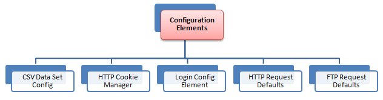

# jMeter Workshop {bgcss=sea-gradient x=0 y=0 rz=-.1 .light-on-dark}

{ height=20% width=20% }

# jMeter Workshop

Agenda:

| Tag 1                         | Tag 2                        |
| ----------------------------- | ---------------------------- |
| jMeter Plugin-Manager         | Verteiltes Testen mit jMeter |
| Strukturierung von Testplänen | RMI                          |
| Workload Design               | Monitoring                   |
| Scripting                     | Containerisierung            |
| Reporting                     | CI/CD-Pipeline               |
| Testdatenverwaltung           | Klärung offener Punkte       |
| REST-APIs                     |                              |

# jMeter Plugin-Manager {bgcss=sea-gradient x=0 y=0 rz=-.1 .light-on-dark}

# jMeter Plugin-Manager

[https://jmeter-plugins.org/wiki/PluginsManager/](https://jmeter-plugins.org/wiki/PluginsManager/)

**Installation:**

- lade **[https://jmeter-plugins.org/get/](https://jmeter-plugins.org/get/)** herunter
- kopiere **jar** in das jMeter-Verzeichnis **lib/ext**

# jMeter Plugin-Manager

**Ausführung über die Kommandozeile:**

[https://jmeter-plugins.org/wiki/PluginsManagerAutomated/](https://jmeter-plugins.org/wiki/PluginsManagerAutomated/)

`PluginsManagerCMD <command> [<params>]`

z.B.

`PluginsManagerCMD install jpgc-fifo,jpgc-json=2.2`

# jMeter Plugin-Manager

**Falls man hinter einem Proxy ist:**

`JVM_ARGS="-Dhttps.proxyHost=myproxy.com -Dhttps.proxyPort=8080 -Dhttp.proxyUser=john -Dhttp.proxyPass=***" PluginsManagerCMD status`

# jMeter Plugin-Manager

**Eigenes Plugin schreiben:**

[https://jmeter.apache.org/usermanual/jmeter_tutorial.html](https://jmeter.apache.org/usermanual/jmeter_tutorial.html)

**Eigenes Repository hinzufügen:**

jMeter-Property setzen:

`jpgc.repo.address=https://jmeter-plugins.org/repo/;http://my.intranet.site/plugins-repo.json`

Das Repository-JSON muss folgendes Format erfüllen: [https://jmeter-plugins.org/wiki/PluginRepositoryDescriptorFormat/](https://jmeter-plugins.org/wiki/PluginRepositoryDescriptorFormat/)

# jMeter Plugin-Manager

**Nützliche Plugins:**

- Custom Thread Groups
- JMXMon Sample Collector
- jp@gc - PerfMon
- jp@gc - Dummy Sampler
- jp@gc - PlanCheck

# jMeter Plugin-Manager

**Ultimate Thread Group**

](assets/ultimate_thread_group1.png){ height=40% width=40% }

# jMeter Plugin-Manager

**Concurrency Thread Group**

](assets/ConcurrencyThreadGroup.png){ height=40% width=40% }

# jMeter Plugin-Manager

**jp@gc - PerfMon**

](assets/servers_performance_monitoring.png){ height=40% width=40% }

# jMeter Plugin-Manager

**jp@gc - Dummy Sampler**

](assets/dummy_sampler.png){ height=40% width=40% }

# jMeter Plugin-Manager

**jp@gc - PlanCheck**

[https://jmeter-plugins.org/wiki/TestPlanCheckTool/](https://jmeter-plugins.org/wiki/TestPlanCheckTool/)

Usage:

`jmeter/lib/ext/TestPlanCheck.sh --jmx MyTestPlan.jmx --stats --tree-dump`

# jMeter Plugin-Manager

**JMXMon Sample Collector**

](assets/jmxmon_samples_collector.png){ height=40% width=40% }

# Elemente/Strukturierung von Testplänen {bgcss=sea-gradient x=0 y=0 rz=-.1 .light-on-dark}

# Elemente/Strukturierung von Testplänen

- Thread Groups
- Sampler
- Controller
- Timers
- Assertions
- Listener
- Pre-/Post-Prozessoren
- Configuration Elements
- Cookie-Manager
- Header-Manager
- User-definierte Variablen
- Testfragment
- Templates
- Ausführungsreihenfolge

# Thread Groups

> A Thread Group in JMeter represents a pool of virtual users performing a set of operations

# Thread Groups

Wichtigste Einstellungen:

- Anzahl Threads
- Anzahl der Wiederholungen
- Ramp-Up-Zeit einstellen (wichtig z.B. für Spike-Testing bei Ticketverkauf!)

# Thread Groups

**Beispiel: Google-Suche**

- Ein Teil der Nutzer verwendet die Text-Suche, andere die News- oder Bilder-Suche

- Hierfür kann man verschieden Thread-Gruppen mit unterschiedlichem Thread-Count anlegen

- In diesen Thread-Gruppen werden diverse Sampler (z.B. Http-Requests) hinzugefügt um die Benutzer-Requests zu simulieren

# Thread Groups

| Name                            | Use-Cases                                                             | Besonderheiten |
| ------------------------------- | --------------------------------------------------------------------- | -------------- |
| Thread Group (classic)          |                                                                       |                |
| Arrivals Thread Group           |                                                                       |                |
| Free Form Arrivals Thread Group |                                                                       |                |
| Concurrency Thread Group        |                                                                       |                |
| Stepping Thread Group           |                                                                       |                |
| Ultimate Thread Group           |                                                                       |                |
| ------------------------------- | --------------------------------------------------------------------- | -------------- |
| setUp Thread Group              | Vorbereiten der Testumgebung (z.B. VM/Container starten, DB befüllen) |                |
| tearDown Thread Group           | Aufräumen der Testumgebung                                            |                |

# Sampler

> Durch Threadgruppen werden Benutzer-Anfragen an den Server simuliert.
> Sampler legen die Art des Requests fest!

# Sampler

- FTP Request
- HTTP Request (can be used for SOAP or REST Webservice also)
- JDBC Request
- Java object request
- JMS request
- JUnit Test request
- LDAP Request
- Mail request
- OS Process request
- TCP request

# Sampler

Falls man mehrere Requests des gleichen Type versendet &rarr; Überlegen of _Defaults Configuration Element_ nützlich sein könnte

# Controller

> Logische Controller legen fest wann/welche Sampler verwendet werden, z.B. Interleave Controller wechselt zwischen zwei HTTP-Request-Samplern

# Timers

> Durch Timer läßt sich in jMeter ein Delay zwischen den Sampler definieren

- Ohne delay könnten zu viele Requests in kurzer Zeit den Server überlasten

- Fügt man mehr als einen Timer zur Thread-Gruppe summiert jMeter die Timer-Zeit und pausiert so lange

- Um Pause an einer bestimmten Stelle im Test Plan zu machen &rarr; Flow Control Action Sampler

# Assertions

> Über Assertions läßt sich prüfen ob sich die Applikation unter Last wie erwartet verhält

- Beispiel: Response enthält bestimmten Text?

- Um Assertion-Ergebnisse anzuzeigen muss man einen Assertion Listener zur Thread-Gruppe hinzufügen

# Listener

> Zeigen die Ergebnisse der Testdurchführung

- Sammeln Ergebnisse von Elementen auf gleichem Level oder darunter

- Eregebnisse können auch in Files (csv, xml) zur weiterverarbeitung weggeschrieben werden

# Pre- und Post-Prozessoren

> Pre-/Post-Prozessoren werden vor/nach Sampler-Request ausgeführt

- Ist ein Pre-/Post-Prozessor direkt an einen Sampler angehängt wird er direkt vor/nach diesem Sampler ausgeführt

- Häufigste Use-Cases:
  - Pre-Prozessor:
    - Settings eines Requests direkt bevor er läuft verändern
    - Variablen Updaten die nicht aus dem Response-Text extrahiert werden.
  - Post-Prozessor:
    - Verarbeiten der Response Daten, z.B extrahieren von Daten

# Configuarion Elementes

> Arbeiten eng mit Samplern zusammen. Kann zwar keine Requests senden, diese aber verändern

Beispiel: Setzen von Defaults und Variablen die später von Samplern verwendet werden können

- Zugriff nur innerhalb des Zweiges in dem das Element hinzugefügt wurde

- Settings werden normalerweise gemerged, wobei Elemente tiefer im Baum vorrang haben.
  - Ausnahme: _User Defined Variables_ werden unabhängig von der Position zu Beginn des Test verarbeitet
  - &rarr; Empfehlung daher: _User Defined Variables_ sollten am Start der Thread-Gruppe positioniert werden

Header Manager, Cookie Manager und Authorization Manager stellen einen weitern Sonderfall dar:

- Setting werden nicht gemerged

- Gibt es mehr als einen Manager im Scope wird nur einer verwendet. Es lässt sich allerdings nicht festlegen welcher!

# Cookie-Manager

# Header-Manager

# User-definierte Variablen

# Testfragment

> Testfragmente sind eine spezielle Art von Controller auf Ebene des Thread Group Elements.

- wird nicht ausgeführt solange es nicht in einem Modul-Controller oder Include-Controller refereniert wird.

- Dient der Code-Wiederverwendung innerhalb von Testplänen

# Templates

# Ausführungsreihenfolge

- Configuration Elements
- Pre-Processors
- Timers
- Sampler
- Post-Processors
- Assertions
- Listeners

# Ausführungsreihenfolge

- Timers, Assertions, Pre-/Post-Processors werden nur ausgeführt, wenn es einen Sampler gibt auf den sie sich beziehen können!
- Logic-Controller und Sampler werden in der Reihenfolge in der sie im Baum stehen ausgeführt
- Andere Testelemente werden entsprechend ihres Scopes ausgeführt

Beispiel-Testplan:

- Controller
  - Post-Processor 1
  - Sampler 1
  - Sampler 2
  - Timer 1
  - Assertion 1
  - Pre-Processor 1
  - Timer 2
  - Post-Processor 2

Ausführungsreihenfolge:

Pre-Processor 1
Timer 1
Timer 2
Sampler 1
Post-Processor 1
Post-Processor 2
Assertion 1

Pre-Processor 1
Timer 1
Timer 2
Sampler 2
Post-Processor 1
Post-Processor 2
Assertion 1

# Workload Design {bgcss=sea-gradient x=0 y=0 rz=-.1 .light-on-dark}

# Workload

Definition:

> The amount of work a system has to perform in a given time. In the performance field, a workload usually refers to combined load placed on an application by the set of clients it services

# Prinzipien

- Vorhersagbarkeit

- Wiederholbarkeit

- Skalierbarkeit

# Vorhersagbarkeit

> Das Verhalten des Systems (z.B. Prozessanfragen, Datenzugriffe, ...) sollte während die Workload läuft vorhersehbar sein.

# Wiederholbarkeit

> Wenn eine Workload mehrere male auf identische Weise ausgeführt wird, sollte die Ergebnis nahezu identisch ausführen. Ansonsten wird eine Performance-Analyse sehr schwer.

# Skalierbarkeit

> Eine Workload solle mit unterschiedlichen Lasten ausgeführt werden können um die Skalierbarkeit der Anwendung testen zu können.

# Workload Design Steps

- Design der Applikation
- Key-Szenarios identifizieren
- Definieren der Metriken
- Design der Load
- Definieren der Skalierungsregeln
- Design des Load-Generators
- Festlegung einer Baseline

# Design der Applikation

- Definieren der Aktoren und Use-Cases &rarr; Hilft die Operationen der Workload zu definieren

- Definieren der Operationen
  - Im einfachsten Fall mappt jeder User-Case auf eine Operation
  - Für sinnvolle Workloads solle die Zahl der benötigen Operation klein gehalten werden (6-8) &rarr; Ansonsten schwer zu managen und verstehen

# Key-Szenarios identifizieren

- Messbares Szenario: Ein User-Szenario das Performance-getestet werden soll, sollte vollständig messbar sein
- Meistbenutzte Szenarios
- Business-kritische Szenarios
- Ressourcen-intensive Szenarios
- Zeitabhängig häufig genutzte Szenarios: z.B. Weihnachts-Liste auf Amazon
- Stakeholder-relevante Szenarien

# Key-Szenarios identifizieren

Beispiel für eine E-Commerce-Applikation:

- Browsen des Produktkatalogs
- Benutzeraccount anlegen
- Nach einem Produkt suchen
- Login
- Bestellung abschicken

Navigationspfade der Key-Szenarios untersuchen

- Auf welche Arten kann ich z.B. eine Bestellung abschicken
- Wie häufig wird welcher Weg genutzt? &rarr; Logfiles oder Analysetools (z.B Matomo)

# Definieren der Metriken

Typische Metriken sind:

- **Durchsatz:** Wie viele Operation können vom SUT während einer gewissen Zeit verarbeitet werden

- **Anwortzeiten:** Zeit zwischen Ende der Anfrage und Beginn der Anwort an das SUT &rarr; Macht normalerweise nur Sinn wenn es auch Anforderungen für Antwortzeiten gibt

- **Ressourcenverbrauch:** z.B. alle Ressourcen (IO, Memory, ...) sollten nicht mehr als 70% der max. Auslastung haben

- **Anzahl maximaler Benutzer:** Wie viele Benutzer können gleichzeitig ohne Probleme auf dem SUT arbeiten

# Design der Load

- der wichtigste Schritt im Workload Design!

- die Relevanz der Workload hängt davon ab wie genau sie die die reale Produktionslast emuliert

- gleichzeit wichtig: die Test-Workload solle sich auf die signifikanten Aspekte der Live-Load konzentrieren &rarr; Ansonsten wird es zu kompliziert

# Design der Load

- **Arrival Rates:** Die Rate mit der Requests an das SUT gestellt werden

- **Think Times:** Zeit zwischen Anzeige der Daten beim Benutzer und seiner nächsten Interaktion &rarr; Bei großen Datenmenge steigt diese Zeit

- **Browser Mix:** Welche Browser sollen im Test verwendet werden? Chrome, Firefox, ...

- **Network Mix:** Welche Netzwerkgeschwindigkeiten sollen im Test verwendet werden? z.B. 3G

# Design der Load

- **Operation Mix:** Festlegung in welcher Frequenz welche Operation durchgeführt wird &rarr; oft prozentual je Operation was sich zu 100% summiert

  - Flat Mix:
    - Einfachste Möglichkeit
    - wird verwendet wenn Operation unabhängig sind und die gleiche Wahrscheinlichkeit haben
    - &rarr; Der Mix wählt eine Operation zufällig
  - Flat Sequence Mix:
    - Spezifiziert ein Set von Operations-Sequenzen
    - z.B. Set1=Op1,Op2 und Set2=Op1,Op3
    - jedem Set wird eine Wahrscheinlichkeit zugeordnet und dementsprechen ausgewählt
  - Matrix Mix (Transition Mix):
    - Beschreibt die Überangswahrscheinlichkeiten in einem Markov-Modell
    - wird häufig bei Web-Apps verwendet

# Design der Load

Beispiel-Workload als Matrix-Mix:

| From   | To Page 1 | To Page 2 | To Page 2 |
| ------ | --------- | --------- | --------- |
| Page 1 | 0,00 %    | 80,00%    | 20,00%    |
| Page 2 | 20,00%    | 39,00%    | 41,00%    |
| Page 3 | 60,00%    | 19,00%    | 21,00%    |

# Design der Load

- **Operation Data:**

  - Abhängig von der Operation müssen für den Request diverse Input-Daten generiert werden

  - Um ein realistisches Szenario zu erhalten sollten die Daten variiert werden &rarr; Bei 100 Items sollten nicht immer fix 5 selektiert werden

  - Best-Practice: Eine klein Zahl an Fehlern durch invalide Daten einfügen um auch Probleme im Error-Handling aufzudecken

  - Genieren "echter" Daten kann bei großen Daten problematisch werden &rarr; Workload Entwickler müsste all Möglichen Values kennen
    - Uniform Random: Generierung von gleichverteilten Zufallsdaten, z.B. für Anzahl gewählter Items
    - Non-Uniform Random: in normalfall sind Datenzugriffe nicht gleichverteilt! &rarr; Datengenerierung sollte Wahrscheinlichkeit berücksichtigen

# Definieren der Skalierungsregeln

Häufig skaliert man durch Erhöhung der emulierten Benutzer. Weiter Möglichkeiten sind:

Linear Scaling

- alles wird über einen einzigen Skalierungsfaktor skaliert
- z.B. Workload führt Datenzugriffe eines Benutzers aus &rarr; Anzahl Benutzer & Anzahl Datenzugriffe werden beide skaliert
- Häufig nützlich für "Sizing"-Zwecke

Non-linear Scaling:

- Anwendungen skalieren oft nicht linear
- z.B. Anwendung erlaubt Tagging durch Benutzer &rarr; mit steigender Anzahl steigt auch die Last je User mit an, z.B. bei der Anzeige der Tags

# Design des Load-Generators

Der Load-Generator implementiert die Workload

Dabei sollte beachtet werden:

- Zum simulieren mehrerer Benutzer-Connections sollte **kein** connection-pooling verwendet werden

- Jeder simulierte Nutzer sollte nach Möglichkeit seinen eigenen "Random number generator" (seeded mit unique value) verwenden um wirklich zufällige Daten zu bekommen

# Festlegung einer Baseline

> "A Baseline is the process of capturing performance metric data for the sole purpose of evaluating the efficacy of successive changes to the system or application. It is important that all characteristics and configurations, except those specifically being varied for comparison, remain the same in order to make effective comparisons as to which change (or series of changes) is driving results toward the targeted goal. Armed with such baseline results, subsequent changes can be made to the system configuration or application and testing results can be compared to see whether such changes were relevant or not." Some considerations when generating baselines include the following:"

https://www.oreilly.com/library/view/performance-testing-with/9781787285774/8c67a2ab-7bda-4a64-bb90-6c0b8785ad60.xhtml

# Zeitliche Verteilung der Last

# Erkennen der Last-Grenzen / Server-Bedarfs

# Scripting {bgcss=sea-gradient x=0 y=0 rz=-.1 .light-on-dark}

# BeanShell

# JSR223

# RegEx-Extractor

# Arbeiten mit JARs

# Reporting {bgcss=sea-gradient x=0 y=0 rz=-.1 .light-on-dark}

# Arten von Reporting

# Ergebnis-Analyse

# Testdatenverwaltung {bgcss=sea-gradient x=0 y=0 rz=-.1 .light-on-dark}

# Testdaten in .json-Datei / .csv-Datei

# jMeter-Funktionen zur Datengenerierung

# REST-APIs {bgcss=sea-gradient x=0 y=0 rz=-.1 .light-on-dark}

# Nutzung des Test-Rekorders

# Testen mit "Http-Request"

# Umgang mit Sessions/Authentification

# Umgang mit dynamischen Daten

# Verteiltes Testen mit jMeter {bgcss=sea-gradient x=0 y=0 rz=-.1 .light-on-dark}

# Master-Slave-Setup

# Master-Slave-Setup

- setup multiple computers/vms/containers
- auf jedem slave: run jmeter-server: **bin/jmeter-server.bat**
- auf dem master:
  - edit **bin/jmeter.properties**: füge alle IPs der slave-systeme komma-separiert unter remote_hosts hinzu (master/slaves müssen im selben Subnetz sein!)
- run test
  - via GUI
  - non-GUI
    - `jmeter -n -t script.jmx -r`
    - `jmeter -n -t script.jmx -R server1,server2,...`

# Master-Slave-Setup

- Jedes Slave-System führt die im Master definierten Dinge aus
  - wollen wir für 10000 Nutzer testen und haben 10 Slaves &rarr; Im Testplan muss für 1000Nutzer geplant werden, damit wir am Ende auf ingesamt 10000 kommen!
- Über den if-Controller lassen sich auf den einzelnen Slaves unterschiedliche Dinge ausführen

# Testausführung über CLI

# RMI {bgcss=sea-gradient x=0 y=0 rz=-.1 .light-on-dark}

# Diskussion: aktueller verwendeter RMI-Sampler

# Vergleich mit existierende RMI-Samplern auf Github

# Monitoring {bgcss=sea-gradient x=0 y=0 rz=-.1 .light-on-dark}

# Prometheus / Grafana

# YourKit-Profiler

# Containerisierung {bgcss=sea-gradient x=0 y=0 rz=-.1 .light-on-dark}

# IaC: Infrastructure as a Code

> Mit IaC (Infrastructure as Code) wird die Infrastruktur durch Code – und nicht durch manuelle Prozesse – verwaltet und provisioniert.

> Mit IaC werden Konfigurationsdateien erstellt, die Ihre gesamten Infrastrukturspezifikationen enthalten, wodurch Sie Konfigurationen einfacher bearbeiten und verteilen können.
> Es stellt außerdem sicher, dass Sie jedes Mal dieselbe Umgebung provisionieren.

> Ein wichtiger Bestandteil von IaC ist die Versionskontrolle. Wie jede andere Software-Quellcodedatei sollten auch Ihre Konfigurationsdateien der Quellkontrolle unterliegen.

# Vagrant + Ansible

Ansible Playbook: [https://galaxy.ansible.com/lean_delivery/jmeter](https://galaxy.ansible.com/lean_delivery/jmeter)

# Docker / Docker-Compose

# Kubernetes

# CI/CD-Pipeline {bgcss=sea-gradient x=0 y=0 rz=-.1 .light-on-dark}

# Github Actions

https://github.com/marketplace/actions/setup-jmeter
https://github.com/marketplace/actions/apache-jmeter
https://github.com/marketplace/actions/perfaction-for-jmeter
https://www.redline13.com/blog/2021/10/github-actions-for-jmeter/
https://dev.to/sebiboga/generate-jmeter-test-report-and-save-it-as-artifact-with-github-actions-4a6b
https://stackoverflow.com/questions/68084554/fail-github-actions-pipeline-if-dockerized-jmeter-tests-failed

# jMeter in einer Github-Actions Pipeline

# JMeter in einer Jenkins-Pipeline

# Klärung offener Punkt {bgcss=sea-gradient x=0 y=0 rz=-.1 .light-on-dark}

TODO:

- Spike-Testing: z.B. SChneller anstieg der Load -> Ticketverkauf
